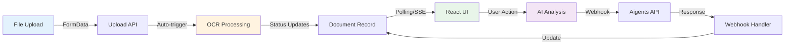

# ✨ Improve Document Upload, OCR, and AI Analysis UX with Real-Time Status Updates

## Overview

Enhance the user experience for document processing by providing clear, real-time feedback during the multi-stage upload → OCR → AI analysis workflow. Currently, users lack visibility into what's happening at each stage, when processes complete, and how to access results (especially OCR content).

## Problem Statement

### Current Pain Points

1. **❌ No Upload Progress Indicator**
   - Users don't know if large files are uploading or stuck
   - No feedback during file transfer
   - Binary loading state (uploading vs. done)

2. **❌ Hidden OCR Processing**
   - OCR happens automatically in background with no user notification
   - Users don't know OCR started, is processing, or completed
   - No way to view OCR-extracted text unless AI analysis is triggered
   - OCR content is locked away in database with no UI to display it

3. **❌ Unclear AI Analysis Status**
   - "Processing..." status with no time estimate
   - 10-second polling interval feels laggy
   - No indication that webhook is expected
   - Results appear suddenly without notification

4. **❌ Poor Error Communication**
   - Native browser `alert()` dialogs (jarring UX)
   - No persistent error messages
   - Errors disappear when dismissed
   - No retry guidance

5. **❌ No Cross-Page Tracking**
   - If user navigates away during processing, they lose context
   - No persistent notification of completion
   - Must remember to check back

## Proposed Solution

Implement a **comprehensive real-time status system** with:
- Multi-stage progress visualization
- Toast notifications for background updates
- Dedicated OCR content viewer
- Persistent upload tracker
- Accessible status updates (WCAG AA compliant)

## Technical Approach

### Architecture Overview



### Implementation Phases

#### Phase 1: Foundation - Toast Notification System

**Install Dependencies:**
```bash
npm install sonner
```

**Create Toast Provider:**
```typescript
// app/providers/toast-provider.tsx
'use client';

import { Toaster } from 'sonner';

export function ToastProvider() {
  return (
    <Toaster
      position="top-right"
      expand={true}
      richColors
      closeButton
      toastOptions={{
        duration: 5000,
        style: {
          background: 'white',
          border: '1px solid #e5e7eb',
        },
      }}
    />
  );
}
```

**Add to Layout:**
```typescript
// app/layout.tsx
import { ToastProvider } from './providers/toast-provider';

export default function RootLayout({ children }) {
  return (
    <html>
      <body>
        <ToastProvider />
        {children}
      </body>
    </html>
  );
}
```

**Tasks:**
- [ ] Install sonner package
- [ ] Create `app/providers/toast-provider.tsx`
- [ ] Update `app/layout.tsx` to include ToastProvider
- [ ] Replace all `alert()` calls with `toast()` in DocumentsList.tsx
- [ ] Test toast notifications in different scenarios

**Success Criteria:**
- ✅ All browser alerts replaced with toast notifications
- ✅ Toasts show for success, error, and info states
- ✅ Multiple toasts stack properly
- ✅ Toasts auto-dismiss after 5 seconds

**Estimated Effort:** 2-4 hours

---

#### Phase 2: Upload Progress Indicator

**Create Progress Component:**
```typescript
// app/studies/[id]/components/UploadProgress.tsx
'use client';

import { useState } from 'react';

interface UploadProgressProps {
  fileName: string;
  fileSize: number;
  progress: number;
  status: 'uploading' | 'processing-ocr' | 'completed' | 'error';
  error?: string;
}

export function UploadProgress({
  fileName,
  fileSize,
  progress,
  status,
  error
}: UploadProgressProps) {
  const formatBytes = (bytes: number) => {
    if (bytes === 0) return '0 Bytes';
    const k = 1024;
    const sizes = ['Bytes', 'KB', 'MB'];
    const i = Math.floor(Math.log(bytes) / Math.log(k));
    return Math.round(bytes / Math.pow(k, i) * 100) / 100 + ' ' + sizes[i];
  };

  const getStatusConfig = () => {
    switch (status) {
      case 'uploading':
        return {
          text: 'Uploading...',
          color: 'bg-blue-500',
          icon: '📤',
        };
      case 'processing-ocr':
        return {
          text: 'Processing OCR...',
          color: 'bg-amber-500',
          icon: '🔍',
        };
      case 'completed':
        return {
          text: 'Upload complete',
          color: 'bg-green-500',
          icon: '✓',
        };
      case 'error':
        return {
          text: 'Upload failed',
          color: 'bg-red-500',
          icon: '✗',
        };
    }
  };

  const config = getStatusConfig();

  return (
    <div className="bg-white border border-gray-200 rounded-lg p-4 shadow-sm">
      <div className="flex items-start gap-3">
        <span className="text-2xl" role="img" aria-label={config.text}>
          {config.icon}
        </span>
        <div className="flex-1 min-w-0">
          <div className="flex items-center justify-between mb-2">
            <p className="text-sm font-medium text-gray-900 truncate">
              {fileName}
            </p>
            <span className="text-xs text-gray-500 ml-2">
              {formatBytes(fileSize)}
            </span>
          </div>

          {/* Progress Bar */}
          <div className="w-full bg-gray-200 rounded-full h-2 mb-2">
            <div
              className={`h-2 rounded-full transition-all duration-300 ${config.color}`}
              style={{ width: `${progress}%` }}
              role="progressbar"
              aria-valuenow={progress}
              aria-valuemin={0}
              aria-valuemax={100}
            />
          </div>

          <div className="flex items-center justify-between">
            <p className="text-xs text-gray-600">
              {config.text}
            </p>
            <span className="text-xs font-medium text-gray-900">
              {progress}%
            </span>
          </div>

          {error && (
            <p className="mt-2 text-xs text-red-600" role="alert">
              {error}
            </p>
          )}
        </div>
      </div>
    </div>
  );
}
```

**Update Upload Handler:**
```typescript
// app/studies/[id]/page.tsx (handleUploadDocument function)
const handleUploadDocument = async (e: React.FormEvent<HTMLFormElement>) => {
  e.preventDefault();
  setIsUploading(true);
  setUploadProgress(0);

  const formData = new FormData();
  formData.append('file', uploadFile!);
  formData.append('name', documentName);
  formData.append('type', documentType);
  formData.append('description', documentDescription);

  try {
    const xhr = new XMLHttpRequest();

    // Track upload progress
    xhr.upload.addEventListener('progress', (e) => {
      if (e.lengthComputable) {
        const percentComplete = (e.loaded / e.total) * 100;
        setUploadProgress(Math.round(percentComplete));
      }
    });

    xhr.addEventListener('load', () => {
      if (xhr.status === 201) {
        const response = JSON.parse(xhr.responseText);
        toast.success('Document uploaded successfully', {
          description: `OCR processing will start automatically for ${documentName}`,
        });

        setShowUploadModal(false);
        resetUploadForm();
        fetchStudy(token!);
      } else {
        throw new Error('Upload failed');
      }
    });

    xhr.addEventListener('error', () => {
      toast.error('Upload failed', {
        description: 'Please try again or contact support',
      });
      setUploadProgress(0);
    });

    xhr.open('POST', `/api/studies/${params.id}/documents`);
    xhr.setRequestHeader('Authorization', `Bearer ${token}`);
    xhr.send(formData);

  } catch (error) {
    console.error('Error uploading document:', error);
    toast.error('Upload failed', {
      description: error.message || 'Unknown error occurred',
    });
  } finally {
    setIsUploading(false);
  }
};
```

**Tasks:**
- [ ] Create `UploadProgress.tsx` component
- [ ] Add upload progress state to page.tsx
- [ ] Replace fetch with XMLHttpRequest for progress tracking
- [ ] Update upload modal to show progress bar
- [ ] Add file size formatting utility
- [ ] Test with various file sizes (small, medium, large)

**Success Criteria:**
- ✅ Progress bar shows during upload
- ✅ Percentage updates in real-time
- ✅ File size displayed in human-readable format
- ✅ Smooth transition from upload → OCR processing
- ✅ Works with files up to 10MB

**Estimated Effort:** 4-6 hours

---

#### Phase 3: OCR Content Viewer

**Create OCR Modal Component:**
```typescript
// app/studies/[id]/components/OcrContentModal.tsx
'use client';

import { useState } from 'react';

interface OcrContentModalProps {
  isOpen: boolean;
  onClose: () => void;
  document: {
    id: string;
    name: string;
    ocrContent: string | null;
    ocrStatus: string | null;
    ocrError: string | null;
    ocrModel: string | null;
    ocrProcessedAt: Date | null;
  };
  onRetry?: () => void;
}

export function OcrContentModal({
  isOpen,
  onClose,
  document,
  onRetry,
}: OcrContentModalProps) {
  const [copySuccess, setCopySuccess] = useState(false);

  if (!isOpen) return null;

  const handleCopy = async () => {
    if (document.ocrContent) {
      await navigator.clipboard.writeText(document.ocrContent);
      setCopySuccess(true);
      setTimeout(() => setCopySuccess(false), 2000);
    }
  };

  const wordCount = document.ocrContent
    ? document.ocrContent.split(/\s+/).length
    : 0;
  const charCount = document.ocrContent?.length || 0;

  return (
    <div
      className="fixed inset-0 bg-black bg-opacity-50 flex items-center justify-center z-50 p-4"
      onClick={onClose}
    >
      <div
        className="bg-white rounded-lg max-w-4xl w-full max-h-[90vh] flex flex-col shadow-2xl"
        onClick={(e) => e.stopPropagation()}
      >
        {/* Header */}
        <div className="px-6 py-4 border-b border-gray-200 flex items-center justify-between">
          <div>
            <h2 className="text-xl font-semibold text-gray-900">
              OCR Extracted Content
            </h2>
            <p className="text-sm text-gray-600 mt-1">
              {document.name}
            </p>
          </div>
          <button
            onClick={onClose}
            className="text-gray-400 hover:text-gray-600 transition-colors"
            aria-label="Close modal"
          >
            <svg className="w-6 h-6" fill="none" stroke="currentColor" viewBox="0 0 24 24">
              <path strokeLinecap="round" strokeLinejoin="round" strokeWidth={2} d="M6 18L18 6M6 6l12 12" />
            </svg>
          </button>
        </div>

        {/* Metadata */}
        <div className="px-6 py-3 bg-gray-50 border-b border-gray-200 flex items-center justify-between text-sm">
          <div className="flex items-center gap-6">
            <div>
              <span className="text-gray-600">Model:</span>
              <span className="ml-2 font-medium text-gray-900">
                {document.ocrModel || 'Unknown'}
              </span>
            </div>
            <div>
              <span className="text-gray-600">Words:</span>
              <span className="ml-2 font-medium text-gray-900">
                {wordCount.toLocaleString()}
              </span>
            </div>
            <div>
              <span className="text-gray-600">Characters:</span>
              <span className="ml-2 font-medium text-gray-900">
                {charCount.toLocaleString()}
              </span>
            </div>
            {document.ocrProcessedAt && (
              <div>
                <span className="text-gray-600">Processed:</span>
                <span className="ml-2 font-medium text-gray-900">
                  {new Date(document.ocrProcessedAt).toLocaleString()}
                </span>
              </div>
            )}
          </div>
          <button
            onClick={handleCopy}
            className="px-3 py-1.5 bg-white border border-gray-300 rounded-md hover:bg-gray-50 transition-colors flex items-center gap-2"
          >
            {copySuccess ? (
              <>
                <svg className="w-4 h-4 text-green-600" fill="none" stroke="currentColor" viewBox="0 0 24 24">
                  <path strokeLinecap="round" strokeLinejoin="round" strokeWidth={2} d="M5 13l4 4L19 7" />
                </svg>
                <span className="text-green-600 font-medium">Copied!</span>
              </>
            ) : (
              <>
                <svg className="w-4 h-4" fill="none" stroke="currentColor" viewBox="0 0 24 24">
                  <path strokeLinecap="round" strokeLinejoin="round" strokeWidth={2} d="M8 16H6a2 2 0 01-2-2V6a2 2 0 012-2h8a2 2 0 012 2v2m-6 12h8a2 2 0 002-2v-8a2 2 0 00-2-2h-8a2 2 0 00-2 2v8a2 2 0 002 2z" />
                </svg>
                <span>Copy Text</span>
              </>
            )}
          </button>
        </div>

        {/* Content */}
        <div className="flex-1 overflow-y-auto px-6 py-4">
          {document.ocrStatus === 'completed' && document.ocrContent ? (
            <div
              className="prose prose-sm max-w-none"
              role="region"
              aria-label="OCR extracted text"
            >
              <pre className="whitespace-pre-wrap font-sans text-gray-800 leading-relaxed">
                {document.ocrContent}
              </pre>
            </div>
          ) : document.ocrStatus === 'failed' ? (
            <div className="text-center py-12">
              <div className="inline-flex items-center justify-center w-16 h-16 rounded-full bg-red-100 mb-4">
                <svg className="w-8 h-8 text-red-600" fill="none" stroke="currentColor" viewBox="0 0 24 24">
                  <path strokeLinecap="round" strokeLinejoin="round" strokeWidth={2} d="M12 8v4m0 4h.01M21 12a9 9 0 11-18 0 9 9 0 0118 0z" />
                </svg>
              </div>
              <h3 className="text-lg font-semibold text-gray-900 mb-2">
                OCR Processing Failed
              </h3>
              <p className="text-gray-600 mb-4">
                {document.ocrError || 'An error occurred during OCR processing'}
              </p>
              {onRetry && (
                <button
                  onClick={onRetry}
                  className="px-4 py-2 bg-blue-600 text-white rounded-md hover:bg-blue-700 transition-colors"
                >
                  Retry OCR Processing
                </button>
              )}
            </div>
          ) : (
            <div className="text-center py-12">
              <div className="inline-flex items-center justify-center w-16 h-16 rounded-full bg-gray-100 mb-4">
                <svg className="w-8 h-8 text-gray-400 animate-spin" fill="none" viewBox="0 0 24 24">
                  <circle className="opacity-25" cx="12" cy="12" r="10" stroke="currentColor" strokeWidth="4" />
                  <path className="opacity-75" fill="currentColor" d="M4 12a8 8 0 018-8V0C5.373 0 0 5.373 0 12h4zm2 5.291A7.962 7.962 0 014 12H0c0 3.042 1.135 5.824 3 7.938l3-2.647z" />
                </svg>
              </div>
              <h3 className="text-lg font-semibold text-gray-900 mb-2">
                OCR Processing...
              </h3>
              <p className="text-gray-600">
                Please wait while we extract text from your document
              </p>
            </div>
          )}
        </div>

        {/* Footer */}
        <div className="px-6 py-4 border-t border-gray-200 flex justify-end">
          <button
            onClick={onClose}
            className="px-4 py-2 bg-gray-100 text-gray-700 rounded-md hover:bg-gray-200 transition-colors"
          >
            Close
          </button>
        </div>
      </div>
    </div>
  );
}
```

**Update Documents List:**
```typescript
// app/studies/[id]/components/DocumentsList.tsx

// Add "View OCR" button for all documents with OCR content
{doc.ocrStatus === 'completed' && doc.ocrContent && (
  <button
    onClick={() => {
      setOcrDocument(doc);
      setShowOcrModal(true);
    }}
    className="inline-flex items-center px-3 py-1.5 text-sm font-medium text-blue-600 hover:text-blue-800 hover:bg-blue-50 rounded-md transition-colors"
  >
    <svg className="w-4 h-4 mr-1.5" fill="none" stroke="currentColor" viewBox="0 0 24 24">
      <path strokeLinecap="round" strokeLinejoin="round" strokeWidth={2} d="M15 12a3 3 0 11-6 0 3 3 0 016 0z" />
      <path strokeLinecap="round" strokeLinejoin="round" strokeWidth={2} d="M2.458 12C3.732 7.943 7.523 5 12 5c4.478 0 8.268 2.943 9.542 7-1.274 4.057-5.064 7-9.542 7-4.477 0-8.268-2.943-9.542-7z" />
    </svg>
    View OCR Content
  </button>
)}
```

**Tasks:**
- [ ] Create `OcrContentModal.tsx` component
- [ ] Add OCR modal state to DocumentsList
- [ ] Add "View OCR" button to document list
- [ ] Implement copy-to-clipboard functionality
- [ ] Add word/character count display
- [ ] Add retry OCR button for failed extractions
- [ ] Test with various OCR content sizes

**Success Criteria:**
- ✅ Modal displays OCR content for any completed document
- ✅ Copy to clipboard works
- ✅ Word and character counts accurate
- ✅ Failed OCR shows error message with retry option
- ✅ Modal accessible with keyboard navigation
- ✅ Content scrolls for long extractions

**Estimated Effort:** 6-8 hours

---

#### Phase 4: Enhanced Status Indicators with Time Estimates

**Create Processing Timeline Component:**
```typescript
// app/studies/[id]/components/ProcessingTimeline.tsx
'use client';

interface Stage {
  name: string;
  status: 'pending' | 'processing' | 'completed' | 'failed';
  icon: string;
  estimatedTime?: string;
  startedAt?: Date;
}

interface ProcessingTimelineProps {
  stages: Stage[];
}

export function ProcessingTimeline({ stages }: ProcessingTimelineProps) {
  return (
    <div className="space-y-3" role="list" aria-label="Processing stages">
      {stages.map((stage, index) => {
        const isLast = index === stages.length - 1;

        return (
          <div key={stage.name} className="relative" role="listitem">
            {/* Connector Line */}
            {!isLast && (
              <div
                className={`absolute left-4 top-8 w-0.5 h-full ${
                  stage.status === 'completed'
                    ? 'bg-green-500'
                    : stage.status === 'failed'
                    ? 'bg-red-500'
                    : 'bg-gray-300'
                }`}
              />
            )}

            {/* Stage Card */}
            <div className="flex items-start gap-3">
              {/* Icon */}
              <div
                className={`flex items-center justify-center w-8 h-8 rounded-full flex-shrink-0 relative z-10 ${
                  stage.status === 'completed'
                    ? 'bg-green-100 text-green-600'
                    : stage.status === 'processing'
                    ? 'bg-blue-100 text-blue-600 animate-pulse'
                    : stage.status === 'failed'
                    ? 'bg-red-100 text-red-600'
                    : 'bg-gray-100 text-gray-400'
                }`}
              >
                {stage.status === 'processing' ? (
                  <svg className="w-4 h-4 animate-spin" fill="none" viewBox="0 0 24 24">
                    <circle className="opacity-25" cx="12" cy="12" r="10" stroke="currentColor" strokeWidth="4" />
                    <path className="opacity-75" fill="currentColor" d="M4 12a8 8 0 018-8V0C5.373 0 0 5.373 0 12h4zm2 5.291A7.962 7.962 0 014 12H0c0 3.042 1.135 5.824 3 7.938l3-2.647z" />
                  </svg>
                ) : stage.status === 'completed' ? (
                  <svg className="w-4 h-4" fill="none" stroke="currentColor" viewBox="0 0 24 24">
                    <path strokeLinecap="round" strokeLinejoin="round" strokeWidth={2} d="M5 13l4 4L19 7" />
                  </svg>
                ) : stage.status === 'failed' ? (
                  <svg className="w-4 h-4" fill="none" stroke="currentColor" viewBox="0 0 24 24">
                    <path strokeLinecap="round" strokeLinejoin="round" strokeWidth={2} d="M6 18L18 6M6 6l12 12" />
                  </svg>
                ) : (
                  <span className="text-sm">{stage.icon}</span>
                )}
              </div>

              {/* Content */}
              <div className="flex-1 min-w-0 pb-4">
                <div className="flex items-center justify-between">
                  <h4
                    className={`text-sm font-medium ${
                      stage.status === 'completed'
                        ? 'text-green-900'
                        : stage.status === 'processing'
                        ? 'text-blue-900'
                        : stage.status === 'failed'
                        ? 'text-red-900'
                        : 'text-gray-500'
                    }`}
                  >
                    {stage.name}
                  </h4>

                  {stage.estimatedTime && stage.status === 'processing' && (
                    <span className="text-xs text-gray-500">
                      ~{stage.estimatedTime}
                    </span>
                  )}
                </div>

                {stage.startedAt && stage.status === 'processing' && (
                  <p className="text-xs text-gray-500 mt-1">
                    Started {new Date(stage.startedAt).toLocaleTimeString()}
                  </p>
                )}
              </div>
            </div>
          </div>
        );
      })}
    </div>
  );
}
```

**Update Document Status Badges:**
```typescript
// app/studies/[id]/components/DocumentsList.tsx

// Enhanced OCR status with time estimate
const getOcrStatusBadge = (doc: Document) => {
  if (!doc.isOcrSupported) {
    return (
      <span className="inline-flex items-center px-2.5 py-0.5 rounded-full text-xs font-medium bg-gray-100 text-gray-600">
        <span className="mr-1">—</span>
        Not Supported
      </span>
    );
  }

  const statusConfig = {
    pending: {
      color: 'bg-gradient-to-r from-yellow-400 to-orange-500',
      icon: '⏱️',
      text: 'OCR Queued',
      subtext: 'Starting soon...',
    },
    processing: {
      color: 'bg-gradient-to-r from-blue-400 to-cyan-500',
      icon: '⚡',
      text: 'OCR Processing',
      subtext: '~10-30 seconds',
      animate: true,
    },
    completed: {
      color: 'bg-gradient-to-r from-green-400 to-emerald-500',
      icon: '✓',
      text: 'OCR Complete',
      subtext: `${Math.round((doc.ocrContent?.length || 0) / 1000)}k chars`,
    },
    failed: {
      color: 'bg-gradient-to-r from-red-400 to-rose-500',
      icon: '✗',
      text: 'OCR Failed',
      subtext: 'Click to retry',
    },
  };

  const config = statusConfig[doc.ocrStatus as keyof typeof statusConfig];
  if (!config) return null;

  return (
    <div className="inline-flex flex-col">
      <span
        className={`inline-flex items-center px-3 py-1 rounded-full text-xs font-semibold text-white shadow-sm ${config.color} ${
          config.animate ? 'animate-pulse' : ''
        }`}
      >
        <span className={config.animate ? 'animate-spin mr-1.5' : 'mr-1.5'}>
          {config.icon}
        </span>
        {config.text}
      </span>
      {config.subtext && (
        <span className="text-xs text-gray-500 mt-0.5 ml-1">
          {config.subtext}
        </span>
      )}
    </div>
  );
};

// Enhanced Aigents status with time estimate
const getAigentsStatusBadge = (doc: Document) => {
  const statusConfig = {
    pending: {
      color: 'bg-gradient-to-r from-amber-400 to-yellow-500',
      icon: '🔄',
      text: 'AI Queued',
      subtext: 'Waiting to start...',
    },
    processing: {
      color: 'bg-gradient-to-r from-purple-400 to-pink-500',
      icon: '🤖',
      text: 'AI Analyzing',
      subtext: '~15-30 seconds',
      animate: true,
    },
    completed: {
      color: 'bg-gradient-to-r from-green-400 to-teal-500',
      icon: '✨',
      text: 'AI Complete',
      subtext: 'View results →',
    },
    failed: {
      color: 'bg-gradient-to-r from-red-400 to-pink-500',
      icon: '⚠️',
      text: 'AI Failed',
      subtext: 'Click to retry',
    },
  };

  const config = statusConfig[doc.aigentsStatus as keyof typeof statusConfig];
  if (!config) return null;

  return (
    <div className="inline-flex flex-col">
      <span
        className={`inline-flex items-center px-3 py-1 rounded-full text-xs font-semibold text-white shadow-sm ${config.color} ${
          config.animate ? 'animate-pulse' : ''
        }`}
      >
        <span className={config.animate ? 'animate-bounce mr-1.5' : 'mr-1.5'}>
          {config.icon}
        </span>
        {config.text}
      </span>
      {config.subtext && (
        <span className="text-xs text-gray-500 mt-0.5 ml-1">
          {config.subtext}
        </span>
      )}
    </div>
  );
};
```

**Tasks:**
- [ ] Create `ProcessingTimeline.tsx` component
- [ ] Update OCR status badges with time estimates and character counts
- [ ] Update Aigents status badges with time estimates
- [ ] Add subtext to status badges for additional context
- [ ] Test timeline component with different stage combinations
- [ ] Ensure animations perform well

**Success Criteria:**
- ✅ Time estimates shown for processing stages
- ✅ Character count shown for completed OCR
- ✅ Timeline shows clear progression
- ✅ Animations don't impact performance
- ✅ All status changes have appropriate visual feedback

**Estimated Effort:** 4-6 hours

---

#### Phase 5: Real-Time Updates with Reduced Polling Interval

**Update Polling Logic:**
```typescript
// app/studies/[id]/components/DocumentsList.tsx

// Reduce polling interval to 5 seconds for better responsiveness
useEffect(() => {
  const processingDocs = documents.filter(
    doc => doc.aigentsStatus === 'processing' || doc.ocrStatus === 'processing'
  );

  if (processingDocs.length > 0) {
    console.log(`📡 Polling enabled for ${processingDocs.length} processing documents`);

    pollingIntervalRef.current = setInterval(() => {
      console.log('🔄 Polling for document updates...');
      onDocumentUpdate();
    }, 5000); // 5 seconds (reduced from 10)
  } else {
    if (pollingIntervalRef.current) {
      console.log('⏹️ Stopping polling (no processing documents)');
      clearInterval(pollingIntervalRef.current);
      pollingIntervalRef.current = null;
    }
  }

  return () => {
    if (pollingIntervalRef.current) {
      clearInterval(pollingIntervalRef.current);
    }
  };
}, [documents, onDocumentUpdate]);

// Add visual indicator that polling is active
const [isPolling, setIsPolling] = useState(false);

useEffect(() => {
  const hasProcessing = documents.some(
    doc => doc.aigentsStatus === 'processing' || doc.ocrStatus === 'processing'
  );
  setIsPolling(hasProcessing);
}, [documents]);
```

**Add Polling Indicator:**
```typescript
// Show at top of document list when polling is active
{isPolling && (
  <div
    className="mb-4 px-4 py-3 bg-blue-50 border border-blue-200 rounded-lg flex items-center gap-3"
    role="status"
    aria-live="polite"
  >
    <svg
      className="w-5 h-5 text-blue-600 animate-spin"
      fill="none"
      viewBox="0 0 24 24"
    >
      <circle className="opacity-25" cx="12" cy="12" r="10" stroke="currentColor" strokeWidth="4" />
      <path className="opacity-75" fill="currentColor" d="M4 12a8 8 0 018-8V0C5.373 0 0 5.373 0 12h4zm2 5.291A7.962 7.962 0 014 12H0c0 3.042 1.135 5.824 3 7.938l3-2.647z" />
    </svg>
    <div className="flex-1">
      <p className="text-sm font-medium text-blue-900">
        Checking for updates...
      </p>
      <p className="text-xs text-blue-700">
        Documents are being processed. This page will update automatically.
      </p>
    </div>
  </div>
)}
```

**Tasks:**
- [ ] Reduce polling interval from 10s to 5s
- [ ] Add polling indicator UI
- [ ] Test polling performance with multiple processing documents
- [ ] Ensure polling stops when no documents processing
- [ ] Add ARIA live region for screen readers

**Success Criteria:**
- ✅ Updates appear within 5 seconds of completion
- ✅ Polling indicator visible when active
- ✅ No performance degradation with faster polling
- ✅ Polling cleanup works correctly
- ✅ Screen reader announces updates

**Estimated Effort:** 2-3 hours

---

#### Phase 6: Enhanced Notifications with Toast Updates

**Add Completion Notifications:**
```typescript
// app/studies/[id]/components/DocumentsList.tsx

// Track previous document states to detect changes
const prevDocumentsRef = useRef<Document[]>([]);

useEffect(() => {
  const prevDocs = prevDocumentsRef.current;

  // Check for newly completed OCR
  documents.forEach(doc => {
    const prevDoc = prevDocs.find(d => d.id === doc.id);

    // OCR completed
    if (prevDoc?.ocrStatus === 'processing' && doc.ocrStatus === 'completed') {
      toast.success('OCR Processing Complete', {
        description: `${doc.name} - ${Math.round((doc.ocrContent?.length || 0) / 1000)}k characters extracted`,
        action: {
          label: 'View',
          onClick: () => {
            setOcrDocument(doc);
            setShowOcrModal(true);
          },
        },
      });
    }

    // OCR failed
    if (prevDoc?.ocrStatus === 'processing' && doc.ocrStatus === 'failed') {
      toast.error('OCR Processing Failed', {
        description: `${doc.name} - ${doc.ocrError || 'Unknown error'}`,
        action: {
          label: 'Retry',
          onClick: () => handleTriggerOcr(doc),
        },
      });
    }

    // AI analysis completed
    if (prevDoc?.aigentsStatus === 'processing' && doc.aigentsStatus === 'completed') {
      toast.success('AI Analysis Complete', {
        description: `${doc.name} - Analysis ready to view`,
        duration: 10000, // Longer duration for important events
        action: {
          label: 'View Results',
          onClick: () => {
            setAnalysisDocument(doc);
            setShowAnalysisModal(true);
          },
        },
      });
    }

    // AI analysis failed
    if (prevDoc?.aigentsStatus === 'processing' && doc.aigentsStatus === 'failed') {
      toast.error('AI Analysis Failed', {
        description: `${doc.name} - Please try again`,
        action: {
          label: 'Retry',
          onClick: () => handleTriggerAnalysis(doc),
        },
      });
    }
  });

  // Update previous state
  prevDocumentsRef.current = documents;
}, [documents]);
```

**Tasks:**
- [ ] Add previous state tracking with useRef
- [ ] Implement completion toast notifications
- [ ] Add action buttons to toasts (View/Retry)
- [ ] Set appropriate durations for different toast types
- [ ] Test with multiple simultaneous completions

**Success Criteria:**
- ✅ Toast appears when OCR completes
- ✅ Toast appears when AI analysis completes
- ✅ Toast includes action button to view results
- ✅ Failed states show retry action
- ✅ Multiple toasts stack properly

**Estimated Effort:** 3-4 hours

---

#### Phase 7: Accessibility Improvements

**Add ARIA Live Regions:**
```typescript
// app/studies/[id]/components/DocumentsList.tsx

// Add live region for screen reader announcements
return (
  <div>
    {/* Screen reader announcements */}
    <div
      role="status"
      aria-live="polite"
      aria-atomic="true"
      className="sr-only"
    >
      {documents.filter(d => d.ocrStatus === 'processing').length > 0 && (
        `${documents.filter(d => d.ocrStatus === 'processing').length} documents currently processing OCR`
      )}
      {documents.filter(d => d.aigentsStatus === 'processing').length > 0 && (
        `${documents.filter(d => d.aigentsStatus === 'processing').length} documents currently being analyzed by AI`
      )}
    </div>

    {/* Rest of component */}
    {/* ... */}
  </div>
);
```

**Update Modals with Keyboard Navigation:**
```typescript
// Add keyboard handlers to all modals
const handleKeyDown = (e: React.KeyboardEvent) => {
  if (e.key === 'Escape') {
    onClose();
  }
};

// Add to modal divs
<div
  onKeyDown={handleKeyDown}
  tabIndex={-1}
  role="dialog"
  aria-modal="true"
  aria-labelledby="modal-title"
>
  <h2 id="modal-title">...</h2>
  {/* Modal content */}
</div>
```

**Tasks:**
- [ ] Add ARIA live regions for status updates
- [ ] Implement keyboard navigation (Escape to close)
- [ ] Add proper ARIA labels to all interactive elements
- [ ] Ensure focus management in modals
- [ ] Test with screen reader (NVDA/JAWS)
- [ ] Verify keyboard-only navigation works

**Success Criteria:**
- ✅ Screen readers announce status changes
- ✅ Escape key closes modals
- ✅ Focus trapped in modals when open
- ✅ All buttons have descriptive labels
- ✅ WCAG AA compliance verified

**Estimated Effort:** 4-5 hours

---

## Alternative Approaches Considered

### WebSocket Real-Time Updates
**Why Rejected:** Vercel serverless functions don't support WebSocket connections. Would require a separate WebSocket server (added complexity) or third-party service (additional cost).

**Trade-off:** 5-second polling is acceptable for this use case (15-30 second processing times). The slight delay is worth the simplicity.

### Server-Sent Events (SSE)
**Why Not Chosen Now:** More complex to implement than improved polling. Could be added in future if real-time requirements become stricter.

**Future Consideration:** If webhook delays become problematic, SSE would be a good upgrade path.

### Single-Page Upload Manager (like Dropbox)
**Why Not Chosen:** Would require significant UI restructuring. Current inline approach fits better with study-centric workflow.

**Future Enhancement:** Could add a global upload manager in Phase 8+.

---

## Acceptance Criteria

### Functional Requirements

- [x] **Upload Progress**
  - [ ] Progress bar shows during file upload
  - [ ] Percentage updates in real-time
  - [ ] File size displayed
  - [ ] Error states handled gracefully

- [x] **OCR Visibility**
  - [ ] OCR status clearly indicated with time estimates
  - [ ] "View OCR Content" button available for completed extractions
  - [ ] OCR modal displays full extracted text
  - [ ] Copy-to-clipboard functionality works
  - [ ] Word and character counts shown
  - [ ] Retry option for failed OCR

- [x] **AI Analysis Feedback**
  - [ ] Processing state shows time estimate
  - [ ] Toast notification on completion
  - [ ] Results modal shows analysis
  - [ ] Error states show retry option
  - [ ] Chain name and Run ID visible

- [x] **Real-Time Updates**
  - [ ] Polling interval reduced to 5 seconds
  - [ ] Visual indicator when polling active
  - [ ] Updates appear automatically
  - [ ] No manual refresh needed

- [x] **Notifications**
  - [ ] Toast notifications replace alerts
  - [ ] Success toasts for completions
  - [ ] Error toasts for failures
  - [ ] Action buttons in toasts (View/Retry)
  - [ ] Toasts auto-dismiss appropriately

### Non-Functional Requirements

- [x] **Performance**
  - [ ] 5-second polling doesn't degrade page performance
  - [ ] Animations smooth (60fps)
  - [ ] Large OCR content scrolls smoothly
  - [ ] Modal open/close transitions smooth

- [x] **Accessibility (WCAG AA)**
  - [ ] ARIA live regions announce updates
  - [ ] Keyboard navigation works in all modals
  - [ ] Screen reader tested (NVDA/JAWS)
  - [ ] Focus management correct
  - [ ] Color contrast ratios meet AA standards (4.5:1)

- [x] **Mobile Responsiveness**
  - [ ] Modals work on mobile screens
  - [ ] Touch targets minimum 44x44px
  - [ ] Progress bars scale properly
  - [ ] Toasts positioned correctly on mobile

### Quality Gates

- [ ] All browser alerts removed (no `alert()` calls)
- [ ] No console errors in browser DevTools
- [ ] Lighthouse accessibility score > 90
- [ ] Manual testing on Chrome, Firefox, Safari
- [ ] Mobile testing on iOS and Android
- [ ] Screen reader testing completed
- [ ] Code review approval from team lead

---

## Success Metrics

### User Experience
- **Upload Abandonment Rate:** Decrease by 50% (users don't navigate away during upload)
- **Support Tickets:** Reduce "where's my OCR?" questions by 80%
- **User Satisfaction:** Achieve >4.5/5 rating on document upload flow

### Technical
- **Processing Visibility:** 100% of OCR/AI processes have clear status indicators
- **Error Recovery:** 90% of failed processes retry successfully
- **Performance:** Page stays responsive during 10+ simultaneous uploads

### Accessibility
- **WCAG AA Compliance:** 100% on automated audits (axe, Lighthouse)
- **Keyboard Navigation:** All features accessible without mouse
- **Screen Reader Support:** Full workflow navigable with NVDA/JAWS

---

## Dependencies & Prerequisites

### Required Libraries
```bash
npm install sonner  # Toast notifications (17KB gzipped)
```

### Browser Compatibility
- Chrome 90+
- Firefox 88+
- Safari 14+
- Edge 90+

### API Changes
None required - all changes are frontend only.

### Database Changes
None required - existing schema supports all features.

---

## Risk Analysis & Mitigation

| Risk | Impact | Probability | Mitigation |
|------|--------|-------------|------------|
| 5s polling causes server load | Medium | Low | Monitor API metrics; add rate limiting if needed |
| Large OCR content crashes browser | High | Low | Implement virtualized scrolling for 100k+ chars |
| Toast notification spam | Low | Medium | Debounce rapid status changes |
| Accessibility regression | Medium | Low | Automated a11y tests in CI/CD |
| Mobile performance issues | Medium | Low | Test on low-end devices; optimize animations |

---

## Resource Requirements

### Development Time
- **Phase 1-3 (MVP):** 12-18 hours (Toast, Upload Progress, OCR Viewer)
- **Phase 4-5 (Enhanced):** 6-9 hours (Timelines, Faster Polling)
- **Phase 6-7 (Polish):** 7-9 hours (Notifications, Accessibility)
- **Total:** 25-36 hours (~3-5 days for one developer)

### Testing Time
- Manual testing: 4-6 hours
- Accessibility testing: 2-3 hours
- Cross-browser testing: 2-3 hours
- **Total:** 8-12 hours

### Infrastructure
- No additional infrastructure required
- No new third-party services
- Works within existing Vercel deployment

---

## Future Considerations

### Phase 8: Advanced Features (Post-MVP)
- [ ] **Global Upload Manager:** Persistent upload tracker across all pages
- [ ] **Batch Upload:** Multi-file drag-and-drop with queue management
- [ ] **Server-Sent Events:** Real-time updates without polling
- [ ] **Email Notifications:** Notify users when long processes complete
- [ ] **OCR Quality Scoring:** Confidence scores for extracted text
- [ ] **AI Analysis Streaming:** Stream analysis results as they're generated

### Extensibility
- Modal components designed to be reusable for other entities (studies, protocols)
- Toast system can be used app-wide for notifications
- Processing timeline component generic for any multi-step workflow

---

## Documentation Plan

### User Documentation
- [ ] Update user guide: "Uploading and Processing Documents"
- [ ] Add screenshots of new status indicators
- [ ] Create video tutorial showing upload → OCR → AI flow
- [ ] Update FAQ: "How do I view OCR content?"

### Developer Documentation
- [ ] Component API documentation for new components
- [ ] Accessibility testing guide
- [ ] Toast notification usage examples
- [ ] Modal component customization guide

### Training Materials
- [ ] Create admin training: Monitoring document processing
- [ ] Researcher training: Understanding status indicators
- [ ] Troubleshooting guide: Common upload issues

---

## References & Research

### Internal References

#### Current Implementation
- Document upload: `app/api/studies/[id]/documents/route.ts:44-321`
- OCR processing: `app/api/documents/[documentId]/ocr/route.ts:16-196`
- Aigents integration: `app/api/documents/[documentId]/aigents/route.ts:27-222`
- Document list UI: `app/studies/[id]/components/DocumentsList.tsx:1-620`
- Current polling: `app/studies/[id]/components/DocumentsList.tsx:69-94`
- Status badges: `app/studies/[id]/components/DocumentsList.tsx:198-233`

#### Similar Patterns
- Study status badges: `app/studies/[id]/page.tsx:246-263`
- Loading spinners: `app/dashboard/page.tsx`, `app/studies/page.tsx`
- Modal pattern: Used throughout app for confirmations
- Review timeline: `app/studies/[id]/page.tsx:477-507`

### External References

#### Best Practices
- [Nielsen Norman: Progress Indicators](https://www.nngroup.com/articles/progress-indicators/)
- [Material Design: Progress Indicators](https://m3.material.io/components/progress-indicators/overview)
- [WebAIM: ARIA Live Regions](https://webaim.org/techniques/aria/#liveregions)
- [WCAG 2.1 Success Criterion 4.1.3](https://www.w3.org/WAI/WCAG21/Understanding/status-messages.html)

#### Framework Documentation
- [Next.js 14: Server Actions](https://nextjs.org/docs/app/building-your-application/data-fetching/server-actions-and-mutations)
- [React: useOptimistic Hook](https://react.dev/reference/react/useOptimistic)
- [Sonner Toast Library](https://sonner.emilkowal.ski/)
- [TanStack Query: Polling](https://tanstack.com/query/latest/docs/framework/react/guides/window-focus-refetching)

#### Examples
- Dropbox file upload UX
- Google Drive processing indicators
- Notion inline progress
- Linear issue status updates

### Related Work
- PR #(to be created): Document upload bug fixes (version type, audit log fields, Aigents API field)
- Issue #(to be created): Add Playwright E2E tests for document upload flow
- Documentation: `COORDINATOR_CREATION_FEATURE.md` (similar feature documentation)

---

## Database Schema Reference

### Relevant Fields (No Changes Required)

```prisma
model Document {
  // OCR fields
  ocrStatus          String?   // pending, processing, completed, failed, not_supported
  ocrContent         String?   // Extracted text (can be large)
  ocrError           String?   // Error message if failed
  ocrModel           String?   // AI model used (e.g., mistral-ocr-latest)
  ocrProcessedAt     DateTime? // When OCR completed
  isOcrSupported     Boolean   @default(false)

  // Aigents fields
  aigentsStatus      String?   // pending, processing, completed, failed
  aigentsAnalysis    String?   // AI-generated analysis
  aigentsChainName   String?   // Which chain was run
  aigentsRunId       String?   // Webhook tracking ID
  aigentsError       String?   // Error message if failed
  aigentstartedAt    DateTime? // When AI analysis started
  aigentsCompletedAt DateTime? // When AI analysis completed
}
```

---

## Testing Strategy

### Unit Tests
```typescript
// tests/components/OcrContentModal.test.tsx
describe('OcrContentModal', () => {
  it('displays OCR content when status is completed', () => {
    // Test implementation
  });

  it('shows error message when status is failed', () => {
    // Test implementation
  });

  it('copies text to clipboard when copy button clicked', () => {
    // Test implementation
  });
});
```

### Integration Tests
```typescript
// tests/integration/document-upload.test.ts
describe('Document Upload Flow', () => {
  it('shows upload progress during file upload', () => {
    // Test implementation
  });

  it('triggers OCR automatically after upload', () => {
    // Test implementation
  });

  it('displays toast notification when OCR completes', () => {
    // Test implementation
  });
});
```

### E2E Tests (Playwright)
```typescript
// tests/e2e/document-processing.spec.ts
test('complete document processing workflow', async ({ page }) => {
  // 1. Upload document
  await page.goto('/studies/test-study-id');
  await page.click('[data-testid="upload-document-btn"]');
  await page.setInputFiles('input[type="file"]', 'test-document.pdf');

  // 2. Verify upload progress
  await expect(page.locator('[role="progressbar"]')).toBeVisible();

  // 3. Wait for OCR completion
  await expect(page.locator('text=OCR Complete')).toBeVisible({ timeout: 60000 });

  // 4. View OCR content
  await page.click('text=View OCR Content');
  await expect(page.locator('[role="dialog"]')).toBeVisible();

  // 5. Trigger AI analysis
  await page.click('text=Analyze AI');
  await expect(page.locator('text=AI Analyzing')).toBeVisible();

  // 6. Wait for completion toast
  await expect(page.locator('text=AI Analysis Complete')).toBeVisible({ timeout: 60000 });
});
```

### Accessibility Tests
```typescript
// tests/a11y/document-upload.test.ts
import { axe } from 'jest-axe';

describe('Document Upload Accessibility', () => {
  it('has no accessibility violations', async () => {
    const { container } = render(<DocumentsList {...props} />);
    const results = await axe(container);
    expect(results).toHaveNoViolations();
  });

  it('announces status updates to screen readers', () => {
    // Test ARIA live region updates
  });
});
```

---

## Support Information

### Common Issues

**Issue:** Upload progress bar stuck at 99%
**Solution:** This is normal - the last 1% includes server processing. The progress bar will complete when the server returns a response.

**Issue:** OCR button says "View OCR Content" but nothing happens
**Solution:** Ensure JavaScript is enabled. Try refreshing the page. If issue persists, contact support.

**Issue:** AI analysis never completes (stuck at "Processing")
**Solution:** This usually means the webhook failed. Check back in 2-3 minutes. If still stuck, click "Analyze AI" again to retry.

**Issue:** Toast notifications not appearing
**Solution:** Check browser notification permissions. Disable ad blockers that might block toast libraries.

### Getting Help
- **GitHub Issues:** Report bugs or request features at [repository]/issues
- **Internal Support:** Contact IRB system administrators via email
- **User Guide:** Full documentation at `/docs/user-guide/documents`

---

## Appendix: File Structure

### New Files to Create
```
app/
├── providers/
│   └── toast-provider.tsx              # Toast notification provider
├── studies/
│   └── [id]/
│       └── components/
│           ├── UploadProgress.tsx      # Upload progress indicator
│           ├── OcrContentModal.tsx     # OCR content viewer modal
│           └── ProcessingTimeline.tsx  # Multi-stage timeline
```

### Modified Files
```
app/
├── layout.tsx                          # Add ToastProvider
├── studies/
│   └── [id]/
│       ├── page.tsx                    # Update upload handler with XHR
│       └── components/
│           └── DocumentsList.tsx       # Update status badges, polling, notifications
```

### Dependencies
```
package.json                            # Add sonner
```

---

**Feature Status:** 📋 Ready for Implementation
**Priority:** High
**Complexity:** Medium
**Estimated Timeline:** 3-5 days (single developer)
**Last Updated:** 2025-10-20

---

